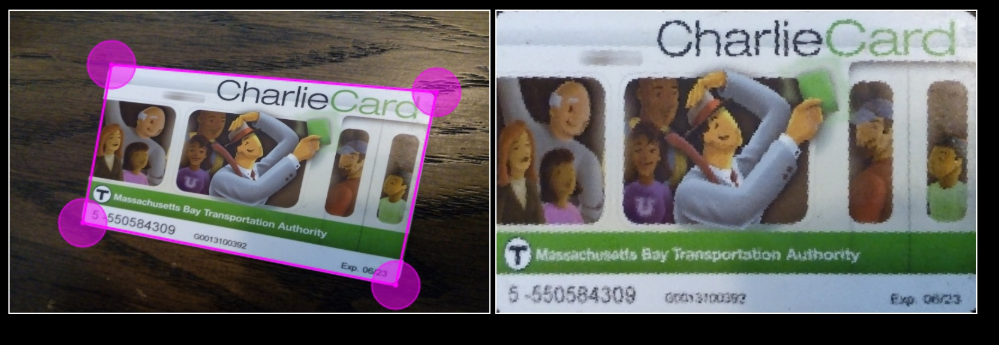

# Un-Warp

A simple JavaScript demo of how to un-warp a flat image photographed at an angle.



## Instructions

```shell
git clone git@github.com:f1lt3r/un-warp.git
npm i http-server -g
npm start  # web browser opens
# click on index.html
```

